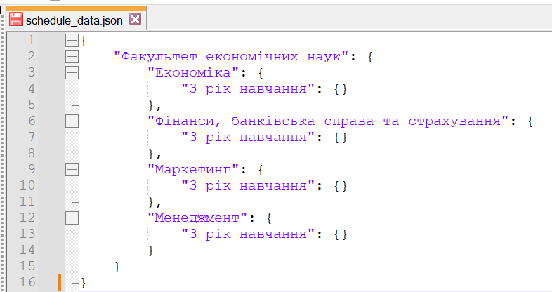

# Unify your schedule with `schedule-parser` 
v0.1
***
### This utility uses .doc or .docx files as 
### input and transforms them into 
### sleek and structured .json 
# Running the util
***
Running the project requires ``Python 3.9`` or later 

You'll need also these libraries to be installed:

- __pywin32__ 306
- __docx-parser__ 1.0.1
- __openpyxl__ 3.1.2
- __pandas__ 2.1.1

Install them using ``pip`` first:

> python3 -m pip install docx-parser

Then replace *input_docx*, *conv_docx* *and output_json* in

>`if __name__ == "__main__":` 

parth of the file and run it

### Features
`convert_doc_to_docx(doc_path, output_docx_path)` 

to turn .doc into .docx first

`shape_data(docx_path, output_json_path)`

to convert .docx into a .json document

be aware, that the parameters use absolute file paths

in case you want to use **relative** paths, remember to put
>`script_dir = os.path.dirname(os.path.abspath(__file__))`
> `input_docx =
os.path.join(script_dir, '{your file name here}.doc')`

in your code
# Usage example
***
Here's an example usage of 3.doc file

It's put inside the root directory of the project:

And declared in code:

After running, we get the message, that it's been converted 
to .docx in console, and a json object as output:

# TODO
- Finish the parsing of the doc files into json
- Parsing of xslx tables
- Encapsulate methods in a class for security
- Properly export utility into a module

### Created for FIdo 2023.